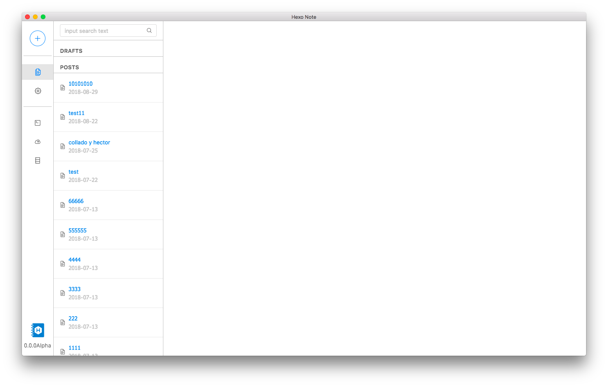

# Hexo-Note
A Hexojs Client project

hexojs 客户端

> first of all, sorry for my English it is not my main language, if you found some mistake, tell me pliz. Thanks!

## Very concerned about your opinion

if you have a opinion or improvement you can write in the Issue and we will discuss it all together.

you can write it with English Spanish or Chinese 

## 非常在意你的想法和意见

如果你有什么想法 意见 或者 改善的地方 可以直接写到 Issue 里，我们来一起讨论.

# Start / 开始

> if you dont have installed hexo js, pliz intall it first (install guide)[https://hexo.io/docs/index.html]

> 如果你没有安装 hexo js 请先安装 (安装教程)[https://hexo.io/zh-tw/docs/index.html]

> if you dont have any created hexo.js blog, pliz created it first (hexo setup guide)[https://hexo.io/docs/setup.html]

> 如果你没有创建任何的 hexojs 项目请先创建 (hexojs 开始教程)[https://hexo.io/docs/setup.html]

# For Developpers / For 同行:

if you have interest to develop it together remember to contact with me!!! tmirun@hotmail.com

如果哪位同学用兴趣一起完善这个项目，请联系我!! tmirun@hotmail.com

## used tecnology / 在这项目中使用了:
- Framework / 框架: [angular6 + electron](https://github.com/maximegris/angular-electron)
- UI / 设计: [ng-zorro ant design](https://github.com/NG-ZORRO/ng-zorro-antd)
  - you can personalize your style in `src/theme.less` / 你可以在 `src/theme.less` 自定义主题
- Icon / 图标: [font awesome](https://fontawesome.com/icons?from=io)
- Editor / 写作框: [code mirror](https://codemirror.net/)

## Arquitecture / 软件框架图
TODO

## run for deploy / 运行
1. Clone project to local / 下载项目到本地
2. open and run `npm start` / 打开执行 `npm start`
3. more scrips see `package.json` / 更多命令看 `package.json`

# TODO LIST
公开 trello [地址](https://trello.com/b/F20B7ufQ)

* [x] 获取 hexo 当地地址 DONE
* [x] 获取文章(区分草稿和已发布)  DONE
* [x] 新增文章 DONE
* [x] 编辑文章 DONE
* [x] 删除文章 DONE
* [ ] 强化 mk 编译器，
    * [x] 添加 toolbar DONE
    * 可自定义 toolbar
    * [x] 可以显示本地文章图片（用方法加的) DONE
    * [x] 添加 Read More DONE
    * [ ]黏贴 imagen: 在 post asset 自动创建如果打开的话
    * [ ]打开文章的图片文件
* [ ] 分类
* [ ] Tag
* [ ] 搜索文章
    * [x] 标题 DONE
    * [ ] 按分类
    * [ ] 按 Tag
* [ ] 热键
    * 保存 cmd + s / ctrl + s,
    * 黑体 cmd + b / ctrl + b,
    * italic cmd + i / ctrl + i,
    * h1-h6 cmd + [1-6] / ctrl + [1-6],
* [x] 启动 HEXO 服务器 DONE
* [x] 软件偏好设置 -- yml DONE
* [x] 一键编译、发布博客 DONE
* [x] 预览博客 DONE
* [ ] 操作日志记录
* [x] 将文章保存为草稿 DONE
* [ ] 自动保存文章
* [ ] 多语言

