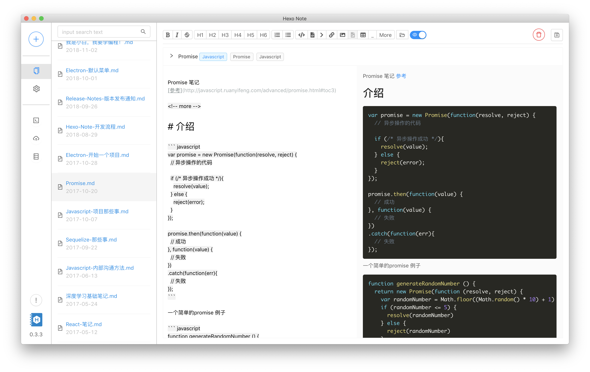

# Hexo-Note

A Hexojs Client project

hexojs 客户端

## Highlights / 特点

You Can Save Image!!!

可以保存图片!!!

## Installation / 安装

Windows, Mac and AppImage binaries are available in the [Releases / 下载](https://github.com/tmirun/Hexo-Note/releases)

Or you can also install from repo,
1. Clone this project to a local folder / 下载项目到本地
2. Run `npm start` / 打开执行 `npm start`
3. More scripts are available in [package.json](package.json) / 更多命令看 [package.json](package.json)

## Prerequisites / 安装需求

- Hexo, see the [installation guide](https://hexo.io/docs/) / 请看 [安装教程](https://hexo.io/zh-cn/docs/)
- At least a blog post, see the [writing guide](https://hexo.io/docs/writing) / 创建至少一篇文章，请看 [写作教程](https://hexo.io/zh-cn/docs/writing)

## Tech stack / 在这项目中使用了:
- Framework / 框架: [angular6 + electron](https://github.com/maximegris/angular-electron)
- UI / 设计: [ng-zorro ant design](https://github.com/NG-ZORRO/ng-zorro-antd)
  - Customize the theme in in `src/theme.less` / 你可以在 `src/theme.less` 自定义主题
- Icon / 图标: [font awesome](https://fontawesome.com/icons?from=io)
- Editor / 写作框: [code mirror](https://codemirror.net/)

## Architecture / 软件框架图
TODO

## Feedback

If you have any opinion or suggestion for improvement, please raise an [Issue](https://github.com/tmirun/Hexo-Note/issues) and we will discuss it together.

You can write it with English, Spanish or Chinese.

如果你有什么想法 意见 或者 改善的地方 可以直接写到 [Issue](https://github.com/tmirun/Hexo-Note/issues) 里，我们来一起讨论.

This documentation is work in progress, if you found any mistake, tell me please. Thanks!

## Contribute / 开发:

Contact me at tmirun@hotmail.com if you wish to develop this program with me.

如果哪位同学用兴趣一起完善这个项目，请联系我 tmirun@hotmail.com

## TODO LIST
公开 trello [地址](https://trello.com/b/F20B7ufQ)

* [x] 获取 hexo 当地地址 DONE
* [x] 获取文章(区分草稿和已发布)  DONE
* [x] 新增文章 DONE
* [x] 编辑文章 DONE
* [x] 删除文章 DONE
* [ ] 强化 mk 编译器，
    * [x] 添加 toolbar DONE
    * [ ] 可自定义 toolbar
    * [x] 可以显示本地文章图片（用方法加的) DONE
    * [x] 添加 Read More DONE
    * [x] 黏贴 imagen: 在 post asset 自动创建如果打开的话
    * [x] 打开文章的图片文件
* [ ] 分类
* [ ] Tag
* [ ] 搜索文章
    * [x] 标题 DONE
    * [ ] 按分类
    * [ ] 按 Tag
* [x] 热键
    * [x] 保存 cmd + s / ctrl + s,
    * [x] 黑体 cmd + b / ctrl + b,
    * [x] italic cmd + i / ctrl + i,
    * [x] h1-h6 cmd + [1-6] / ctrl + [1-6],
* [x] 启动 HEXO 服务器 DONE
* [x] 软件偏好设置 -- yml DONE
* [x] 一键编译、发布博客 DONE
* [x] 预览博客 DONE
* [ ] 操作日志记录
* [x] 将文章保存为草稿 DONE
* [ ] 自动保存文章
* [ ] 多语言
